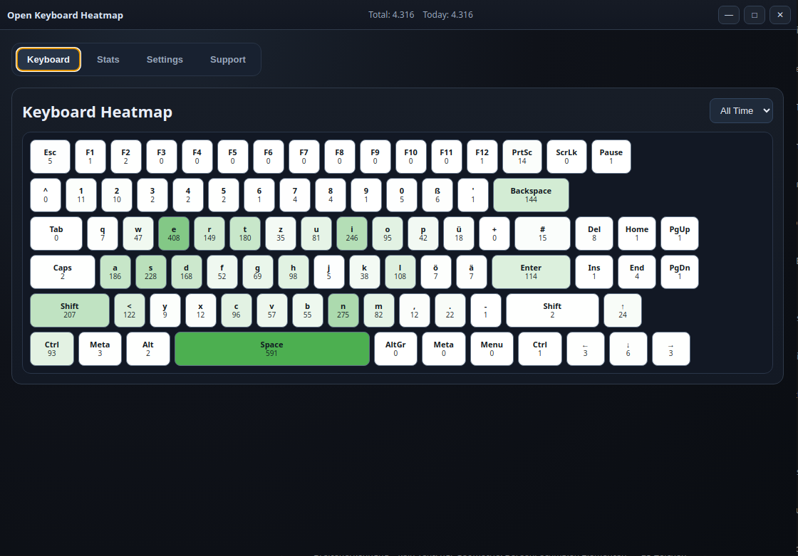
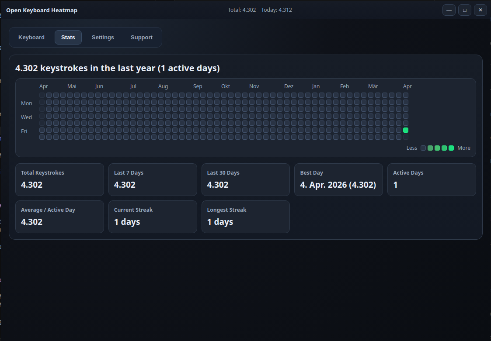

# Open Keyboard Heatmap

> A secure, privacy-respecting keystroke tracker, typing statistics dashboard, and keyboard heatmap for Windows, macOS, and Linux.

**TL;DR:** Open Keyboard Heatmap is an open-source Electron and React desktop app that captures global keyboard activity with `uiohook-napi` and optional Linux `evdev` access, converts that input into aggregate per-key counts, stores those counts locally in an encrypted SQLite database, and visualizes the result as an interactive keyboard heatmap plus daily typing statistics. It is intentionally designed to avoid keylogging behavior: it does not store typed text, key sequences, per-event timestamps, cloud data, or telemetry.

[](https://www.gnu.org/licenses/agpl-3.0)

## Screenshots

### Keyboard Heatmap



### Stats Dashboard



## Who Is This For?

Open Keyboard Heatmap is built for people who want keyboard analytics and typing statistics without giving up privacy.

- Developers tracking typing habits, coding-heavy workflows, and key usage patterns
- Mechanical keyboard enthusiasts comparing layouts, keyboards, or long-term key wear hotspots
- People doing ergonomics optimization and trying to reduce strain on specific fingers or keys
- Gamers analyzing APM-like keyboard activity, hotkey-heavy playstyles, and input trends over time
- Privacy-conscious users who want a local-first keystroke tracker with no account, no sync, and no telemetry
- Anyone looking for an open-source, privacy-focused alternative to WhatPulse for keyboard-only analytics

## Features

### Keyboard tab

- Live keyboard heatmap with per-key counts
- `All Time` and `Today` views for long-term and daily typing analysis
- Layout-aware labels with support for QWERTY, QWERTZ, AZERTY, and other physical layouts
- Extended key coverage for modifiers, arrows, navigation keys, and ISO keys
- Running totals in the title bar so overall keyboard activity is visible at a glance

### Stats tab

- GitHub-style contribution grid for the last 365 days
- Total keystrokes, rolling 7-day totals, and rolling 30-day totals
- Best day, active day count, and average per active day
- Current streak and longest streak

### Settings tab

- Shows database path and active debug log path
- Opens the data folder and debug log directly from the app
- Encrypted backup and restore flow for your local database

### Support tab

- Buy Me a Coffee button that opens in your system browser
- BTC and DOGE QR codes plus copy-to-clipboard actions

### Logging and troubleshooting

- Daily debug logs stored in `<app-data>/logs/debug-YYYY-MM-DD.log`
- Renderer and main-process actions are logged for capture, maintenance, and external-link troubleshooting

## Why Open Keyboard Heatmap?

Open Keyboard Heatmap is designed as a local-first keyboard usage analyzer, not a cloud analytics product. If you are searching for a WhatPulse alternative that is open source, privacy-respecting, and focused on aggregate keyboard heatmaps instead of behavior reconstruction, this is the problem the app is built to solve.

- Local-first by default: no cloud sync, no remote database, no outbound telemetry
- Privacy model centered on aggregate data: only per-key, per-day counts are persisted
- Not useful as a traditional keylogger: typed text, key order, and precise timestamps are never stored
- Encrypted local storage: the SQLite database uses a separate local key file
- Cross-platform desktop app for Windows, macOS, and Linux

## How It Works / Architecture

1. The Electron main process listens for global keyboard events through `uiohook-napi`. On Linux, the app can also use `evdev` device access in environments where that is preferred or required.
2. Incoming scan codes are mapped to layout-independent physical key names and aggregated in memory. The app discards key order immediately and does not persist raw event streams.
3. Every 5 to 30 seconds, the in-memory buffer is flushed into the local SQLite database. The app stores only aggregate rows shaped like `key_name + day + count`, truncates time data to `YYYY-MM-DD`, and shuffles insert order before writing.
4. The React renderer reads the aggregated counts and daily stats over Electron IPC and turns them into the keyboard heatmap, contribution grid, streaks, and summary cards.

## Security & Privacy Model

This app is designed so that even if someone gets the database file, they still do not get typed text or password reconstruction data.

| Measure | Detail |
|---|---|
| No sequences | Only aggregate counts per key per day are stored |
| No time-of-day | Timestamps are truncated to `YYYY-MM-DD` |
| Randomized inserts | Database writes are Fisher-Yates shuffled |
| Random flush interval | Buffered writes happen after a randomized 5 to 30 second delay |
| Local only | No cloud sync, no remote database, no outbound telemetry |
| Encrypted storage | The SQLite database uses a separate local key file |

## Prerequisites

### Linux

```bash
sudo apt install libx11-dev libxtst-dev libxt-dev libxinerama-dev \
  libx11-xcb-dev libxkbcommon-dev libxkbcommon-x11-dev libxkbfile-dev
```

On Linux the app tries global capture even while minimized. It can use `uiohook` and, when available, Linux `evdev` device access. If you are testing full-device capture on Wayland or locked-down systems, running with elevated privileges may still be necessary.

### macOS

Grant Accessibility permission to the app in System Settings -> Privacy & Security -> Accessibility.

### Windows

No extra setup is normally required.

## Development

```bash
# install dependencies
npm install

# start in development
npm run dev

# run tests
npm test

# build production artifacts
npm run build
```

Linux helper scripts:

- `./scripts/linux-run-built-sudo.sh` builds the latest app and starts the built version with elevated privileges for capture testing
- `./scripts/linux-build-appimage-and-run-sudo.sh` builds an AppImage workflow for Linux packaging tests

## Release Builds

- Linux: `./scripts/release-linux-artifacts.sh vX.X.X`
- Windows: `powershell -ExecutionPolicy Bypass -File .\scripts\release-windows-artifacts.ps1 vX.X.X`
- macOS: `./scripts/release-macos-artifacts.sh vX.X.X`
- Each script is native-only and does not cross-build.
- Artifacts are written into `release-artifacts/vX.X.X/` with per-platform checksum files.

## Tech Stack in Context

- Electron: packages the app as a cross-platform desktop client and hosts the privileged main process that performs keyboard capture, IPC, and local file access.
- React and TypeScript: power the renderer UI, the heatmap, the typing statistics dashboard, and the shared data models used across the app.
- Vite and `electron-vite`: provide the development workflow and production build pipeline for the renderer, preload, and main-process bundles.
- `uiohook-napi`: captures global keyboard events across supported desktop platforms so the app can measure keyboard usage outside the focused window.
- Linux `evdev` support: gives the app an additional capture backend for Linux systems where direct device access is preferred or required.
- SQLite via `better-sqlite3-multiple-ciphers`: stores daily aggregate key counts locally with on-device encryption and WAL mode for durable offline storage.
- Vitest: covers key mapping, aggregation logic, date handling, preload APIs, and privacy-sensitive persistence behavior.

## FAQ

**Q: Is my keystroke data sent to a cloud server?**  
No. Open Keyboard Heatmap is strictly local-first. It does not send keyboard data to a cloud service, sync backend, analytics pipeline, or telemetry endpoint.

**Q: Does the app store everything I type?**  
No. It stores aggregate counts per key per day, not words, sentences, typed text, or password strings.

**Q: Can this app be used as a keylogger?**  
No. Typed text, key order, and precise per-event timestamps are never stored. The persisted data is limited to aggregate daily counters such as how often a physical key was pressed on a given date.

**Q: Does it work while the app is minimized or in the background?**  
Yes. The app is built around global keyboard capture. On Linux, capture mode can depend on `uiohook`, `evdev`, and local system permissions.

**Q: Is this an alternative to WhatPulse?**  
Yes, if your main goal is open-source, privacy-focused, local-only keyboard analytics and heatmaps without cloud services or telemetry.

**Q: Where is my data stored?**  
The app stores data in its local user-data folder as an encrypted SQLite database plus a separate local key file. The Settings tab can open the data folder and debug log path directly.

## Contributing

Feature requests and pull requests are welcome. If you want to help prioritize work, opening a PR is the fastest path. Support is optional and does not change the AGPL license terms.

## Support

If you find this useful, consider supporting development:

<a href="https://buymeacoffee.com/michaelsant0s">
  
</a>

BTC donations:  
`bc1q273jxf4xq87qggcjfw6d8v038rwqyygcsxmw8f`


DOGE donations:  
`DASGta7VgHuxUCvDh9v5cfRCFLirjs611B`


## License

This project is licensed under the GNU Affero General Public License v3.0 or later. See [LICENSE](LICENSE) for details.
